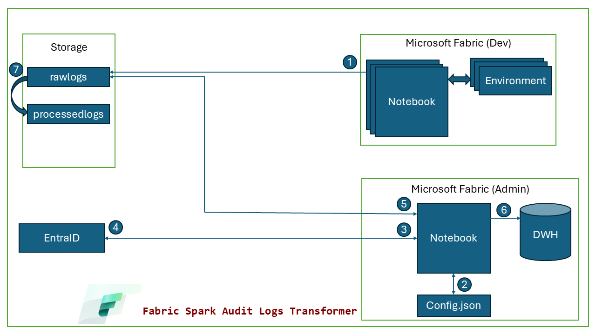
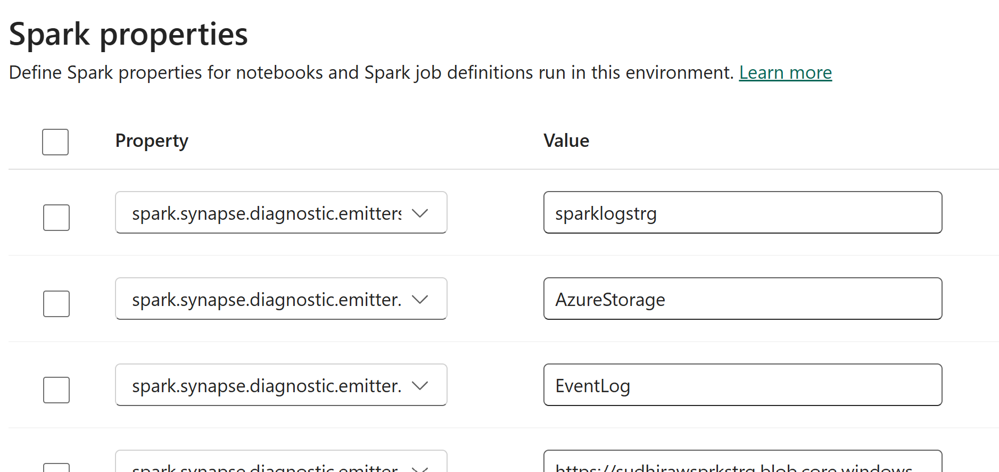
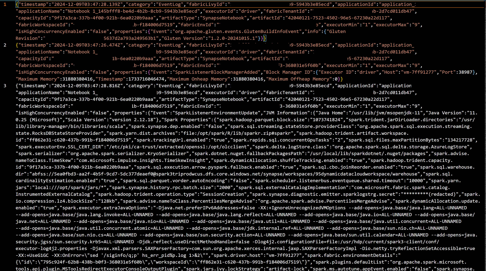
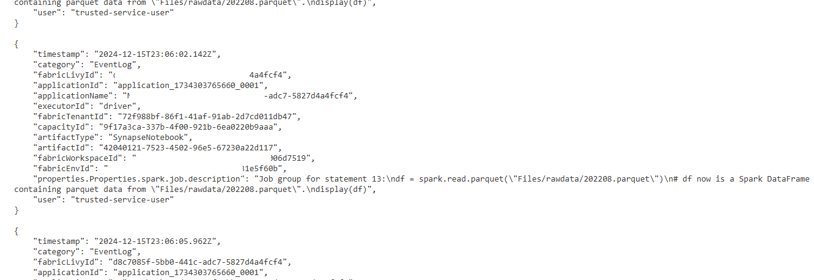

# Fabric Spark Audit Logs Transformer

## 1. Introduction
Apache Spark is widely adopted for large-scale data processing, but auditing Spark job execution can be challenging due to its distributed nature. To simplify this, Microsoft Fabric recently introduced the **Apache Spark Diagnostic Emitter**, enabling customers to capture various Spark logs for better observability and compliance. These logs include **DriverLog**, **ExecutorLog**, **EventLog**, and **Metrics**, providing a holistic view of Spark application execution.

In this post, we’ll focus on transforming **job execution logs** and storing them in a **lakehouse** or **data warehouse** using a **Service Principal** for secure access.

## 2. Business Requirements
- Capture and monitor Spark job execution logs for **auditing and compliance**.
- Transform logs to focus on **job execution details**.
- Store transformed logs in a **centralized repository** like a **lakehouse** or **data warehouse**.
- Ensure secure access using a **Service Principal** for authentication.

## 3. Prerequisites
Before implementing the solution, ensure the following:
- Access to **Microsoft Fabric** with a provisioned **Apache Spark environment**.
- Configured **Spark Diagnostic Emitter** as per [Microsoft Learn’s guide](https://learn.microsoft.com/en-gb/fabric/data-engineering/azure-fabric-diagnostic-emitters-azure-storage).
- A **Service Principal** with appropriate permissions to read/write data to the lakehouse or warehouse.
- Basic understanding of **Spark Notebooks** in Microsoft Fabric.

## 4. Solution Workflow
The solution can be broken into the following steps:
1. Configure the Spark Diagnostic Emitter to capture all log types.
2. Extract and transform logs to isolate **job execution details**.
3. Use a Spark notebook to process and format logs.
4. Write the transformed logs to a **lakehouse** or **data warehouse**.
5. Automate the workflow for continuous monitoring.



## 5. Step-by-Step Implementation

### Step 1: Configure Spark Diagnostic Emitter
- Use the [Microsoft Learn documentation](https://learn.microsoft.com/) to enable the **Spark Diagnostic Emitter** in your Fabric environment.
- Ensure that all log types (“DriverLog”, “ExecutorLog”, “EventLog”, and “Metrics”) are captured and stored in a **raw logs directory**. For this blog post we only capture "EventLog"



### Step 2: Extract and Transform Logs
- Create a **Spark Notebook** to process logs:
  - Get token for authentication     
  - Read raw logs from the configured storage.
  - Parse logs to focus on **job execution details** like timestamp, fabricLivyId, applicationName, fabricWorkspaceId, Spark Job Description, user etc .

#### Sample Code Snippet
```python
import os
import json
from azure.storage.blob import BlobServiceClient, ContainerClient
from azure.identity import ClientSecretCredential

global_user = None

# Define the extract_fields function

def extract_fields(json_content):
    try:
        spark_job_description = json_content.get("properties", {}).get("Properties", {}).get("spark.job.description")
        if spark_job_description is None:
            user = json_content.get("properties", {}).get("User", "")
            if user:  # If properties.User is not empty or None
                global global_user
                global_user = user
                print(global_user)
            return None  # Do not return anything if spark.job.description is null

        return {
            "timestamp": json_content.get("timestamp"),
            "category": json_content.get("category"),
            "fabricLivyId": json_content.get("fabricLivyId"),
            "applicationId": json_content.get("applicationId"),
            "applicationName": json_content.get("applicationName"),
            "executorId": json_content.get("executorId"),
            "fabricTenantId": json_content.get("fabricTenantId"),
            "capacityId": json_content.get("capacityId"),
            "artifactType": json_content.get("artifactType"),
            "artifactId": json_content.get("artifactId"),
            "fabricWorkspaceId": json_content.get("fabricWorkspaceId"),
            "fabricEnvId": json_content.get("fabricEnvId"),
            "properties.Properties.spark.job.description": json_content.get("properties", {}).get("Properties", {}).get("spark.job.description"),
            "user": global_user
        }
    except Exception as e:
        print(f"Error extracting fields: {e}")
        return {}
# Load configuration
with open("/lakehouse/default/Files/spnconfig.json", "r") as config_file:
    config = json.load(config_file)
# Service principal credentials
tenant_id = config["tenant_id"]
client_id = config["client_id"]
client_secret = config["client_secret"]
storage_account_name = config["storage_account_name"]
src_container_name = config["src_container_name"]
dest_container_name = config["dest_container_name"]
credential = ClientSecretCredential(tenant_id, client_id, client_secret)
# Construct the storage account URL
account_url = f"https://{storage_account_name}.blob.core.windows.net"
# Initialize Blob Service Client
blob_service_client = BlobServiceClient(account_url=account_url, credential=credential)
container_client = blob_service_client.get_container_client(src_container_name)
# List unique folders in the container

....................

```
**Full code** :- [Source Code](https://github.com/rawat-sudhir/fabric-spark-audit-logs-transformer/tree/main/src-code)

### Output

| Before Transformation | After Transformation |
|----------------------|---------------------|
|  |  |


### Step 3: Store Logs in Lakehouse or Warehouse
- Transform json data in dataframe and store it in lakehouse/datawarehouse. 


### Step 4: Automate the Workflow
- Schedule the notebook to run at regular intervals.
- Monitor the pipeline for successful execution.

## 6. Conclusion
The **Spark Diagnostic Emitter** in Microsoft Fabric empowers organizations to monitor and audit Spark execution with ease. By focusing on job execution logs and leveraging lakehouse/warehouse storage, businesses can maintain compliance and gain valuable insights into their data processing workflows. With this step-by-step guide, you can set up an efficient and secure pipeline for Spark log auditing.
